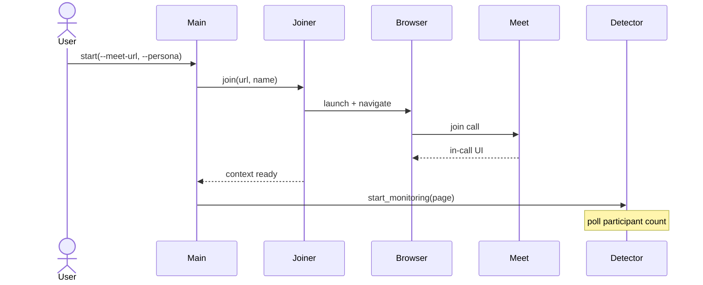
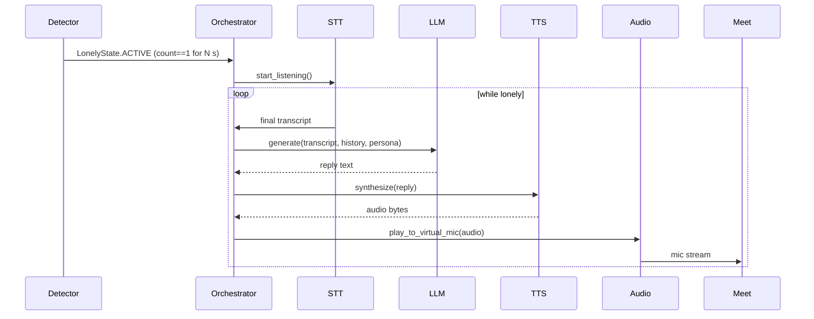
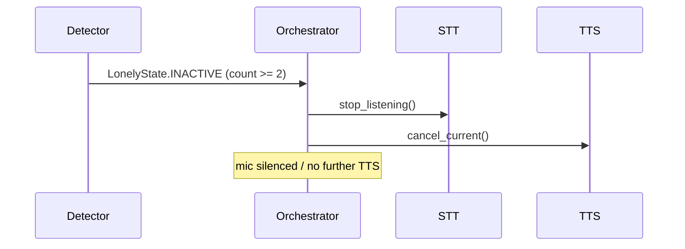

# Sequence Descriptions

## 1. Application Startup & Join

## 2. Lonely Activation + Speak Cycle

## 3. Interrupt (Someone Joins)

Copy the Mermaid blocks into `docs/diagrams/*.mmd` when ready for rendering.
